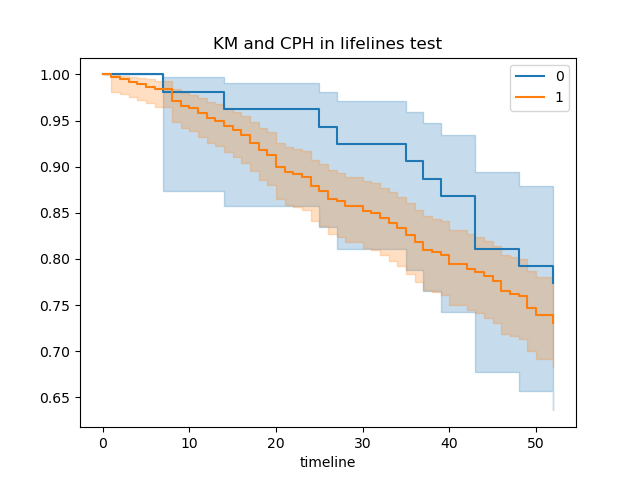
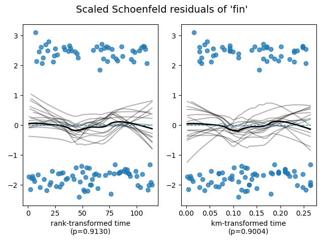

# lifelines_tool - lifelines statistical package wrapped as a Galaxy tool.

## Install to your Galaxy server from the toolshed - search for lifelines_tool owned by fubar2

### More at https://lazarus.name/demo/

#### Input data

#### Tool output

and

and

Galaxy tool to run failure time models using lifelines

Runs Kaplan-Meier and generates a plot. Optional grouping variable.
If 2 groups, runs a log-rank test for difference.
Plots show confidence intervals

If a list of covariate column names is provided, these are used in a
Cox Proportional Hazards model with tests for proportionality.

Should work with any tabular data with the required columns - time and status for observations.

Issues to https://github.com/fubar2/lifelines_tool please.
Autogenerated so pull requests are possibly meaningless but regeneration of a new version is easy so please tell me what is needed.

## Tool made with the Galaxy ToolFactory: https://github.com/fubar2/galaxy_tf_overlay
The current release includes this and a generic tabular version, and a java .jar wrapper in a history where the generating
ToolFactory form can be recreated using the redo button. Editing the tool id will make a new tool, so all other edits to parameters can be
made and the new tool generated without destroying the original sample.

