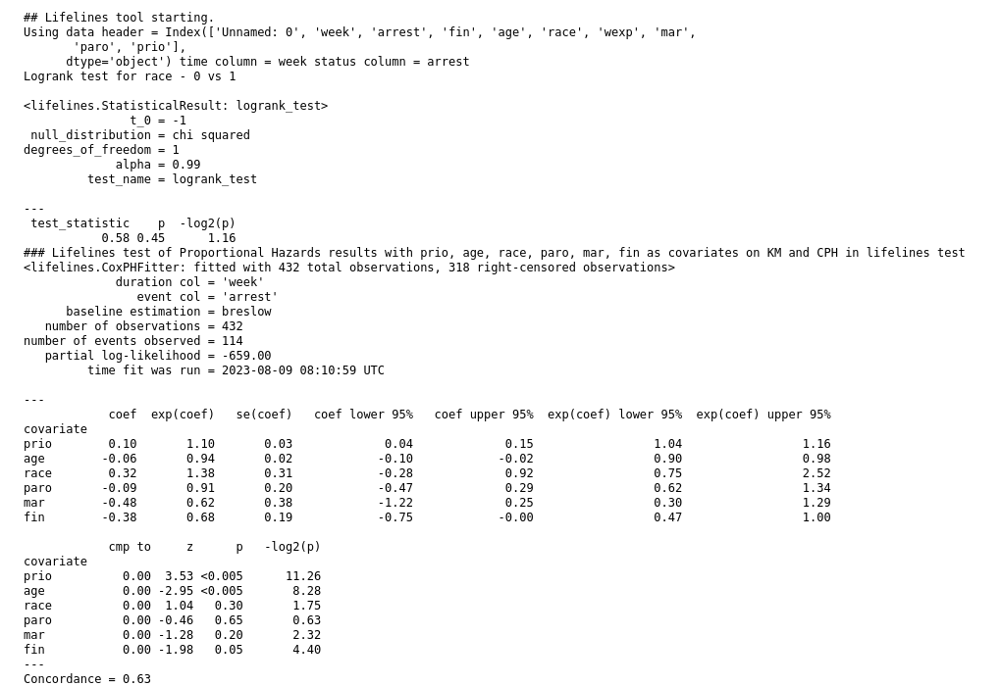
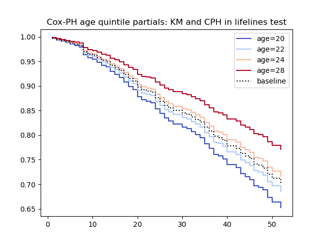
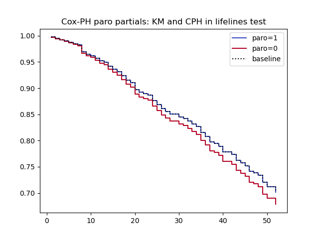

# lifelines_tool - lifelines statistical package wrapped as a Galaxy tool.

A Galaxy tool for right censored failure time data.

Provides Kaplan-Meier plots with confidence intervals, and optional Cox proportional hazards models

Uses the [lifelines](https://lifelines.readthedocs.io/en/latest/index.html) package.

### Install to your Galaxy server from the toolshed - search for lifelines_km_cph_tool owned by fubar2

More at https://lazarus.name/demo/

#### Using the Rossi sample recidivism data from lifelines:

Runs Kaplan-Meier and generates a plot. Optional grouping variable.

Plots show confidence intervals

If 2 groups, runs a log-rank test for difference.

If a comma separated list (for example: prio, age, race, mar, fin) of covariate column names is provided,
a Cox proportional hazards model is run, the assumption of proportionality is tested, and
recommendations made.

Also included are partial plots for each covariate like these from the Rossi recidivism lifelines sample data
used in the tool test.

Uses pandas read_csv with tabular delimiters so should work with any tabular data with the required columns - time and status for observations.

Issues to https://github.com/fubar2/lifelines_tool please.
Autogenerated so pull requests are possibly meaningless but regeneration of a new version should work.

## Tool made with the Galaxy ToolFactory: https://github.com/fubar2/galaxy_tf_overlay
The current release includes this and a generic tabular version, and a java .jar wrapper in a history where the generating
ToolFactory form can be recreated using the redo button. Editing the tool id will make a new tool, so all other edits to parameters can be
made and the new tool generated without destroying the original sample.

